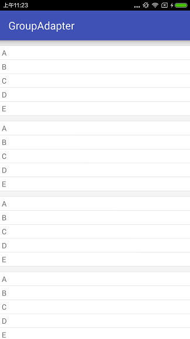
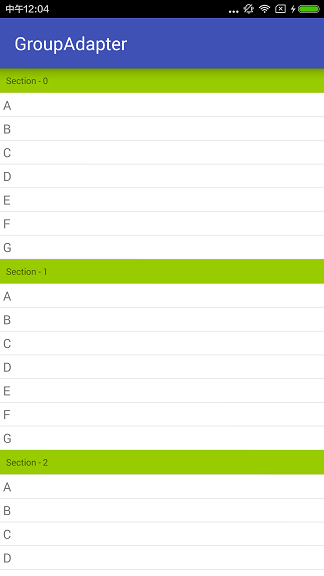

# GroupAdapter
Most company's APP products usually make only one design for iOS & Android.  
This project provide a simple file 'GroupAdapter' for Android to implement section group list style like iOS, You only need make your listView adapter extends this one, and implement some methods.

##  Sample sceenshot

#### Simple
It supply a 10 dip height gray section by default. 

    class Adapter extends GroupAdapter {
    
        private String[] data = {"A", "B", "C", "D", "E", "F", "G"};

        public Adapter(Context context) {
            super(context);
        }

        @Override
        public int getSectionCount() {
            return 10;
        }

        @Override
        public int getCountInSection(int section) {
            return 5;
        }

        @Override
        public View getViewForRow(View convertView, ViewGroup parent, int section, int row) {
            TextView tv = new TextView(SimpleSample.this);
            tv.setText(data[row]);
            tv.setPadding(10, 10, 10, 10);
            return tv;
        }
    }

#### Custom Section
You can set a custom view for the section view. 

    class Adapter extends GroupAdapter {

        private String[] data = {"A", "B", "C", "D", "E", "F", "G"};

        public Adapter(Context context) {
            super(context);
        }

        @Override
        public int getSectionCount() {
            return 10;
        }

        @Override
        public int getCountInSection(int section) {
            return data.length;
        }

        @Override
        public View getViewForRow(View convertView, ViewGroup parent, int section, int row) {
            TextView tv = new TextView(CustomSectionSample.this);
            tv.setText(data[row]);
            tv.setPadding(10, 10, 10, 10);
            return tv;
        }

        @Override
        public View getViewForSection(View convertView, ViewGroup parent, int section) {
            FrameLayout sectionView = new FrameLayout(CustomSectionSample.this);
            sectionView.setBackgroundResource(android.R.color.holo_green_light);

            TextView tv = new TextView(CustomSectionSample.this);
            tv.setTextSize(10);
            int padding = 20;
            tv.setPadding(padding, padding, padding, padding);
            tv.setText("Section - " + section);

            sectionView.addView(tv);
            return sectionView;
        }
    }

    

## Handler the click even
    @Override
    public void onItemClick(AdapterView<?> adapterView, View view, int position, long id) {
        GroupAdapter.IndexPath ip = adapter.getIndexForPosition(position);
        Toast.makeText(this, adapter.data[ip.row], Toast.LENGTH_SHORT).show();
    }

